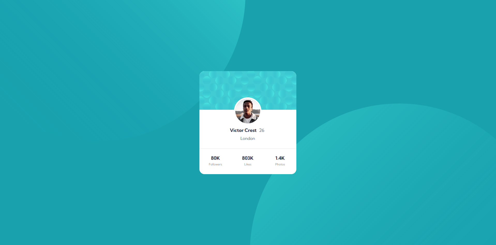
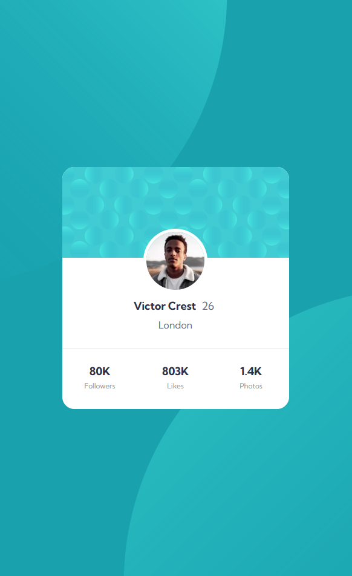

# Frontend Mentor - Profile card component

This is a solution to the [Profile card component challenge on Frontend Mentor](https://www.frontendmentor.io/challenges/profile-card-component-cfArpWshJ).

## Table of contents

- [Frontend Mentor - Profile card component](#frontend-mentor---profile-card-component)
  - [Table of contents](#table-of-contents)
  - [Overview](#overview)
    - [Screenshot](#screenshot)
    - [Links](#links)
  - [My process](#my-process)
    - [Built with](#built-with)
    - [What I learned](#what-i-learned)
    - [Continued development](#continued-development)
  - [Author](#author)

## Overview

### Screenshot

    My desktop solution VS The desktop design
     
    
    

 

     My mobile solution VS The mobile design
     
    
    

### Links

- Solution URL: [FrontEnd Mentor: My solution](https://www.frontendmentor.io/solutions/responsive-profile-card-component-7FjFcQ16xL)
- Live Site URL: [GitHub Page: My solution](https://andresssg.github.io/Profile-Card/)

## My process

### Built with

- Semantic HTML5 markup
- CSS custom properties
- Flexbox and Grid

### What I learned

I learn how to make a responsive design.

### Continued development

I want to continue making responsive components to incorporate them into other projects and someday make a fully responsive website.

## Author

- Frontend Mentor - [@Andresssg](https://www.frontendmentor.io/profile/Andresssg)